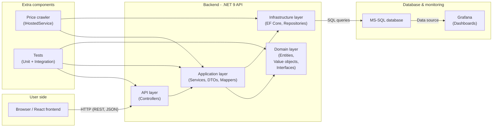
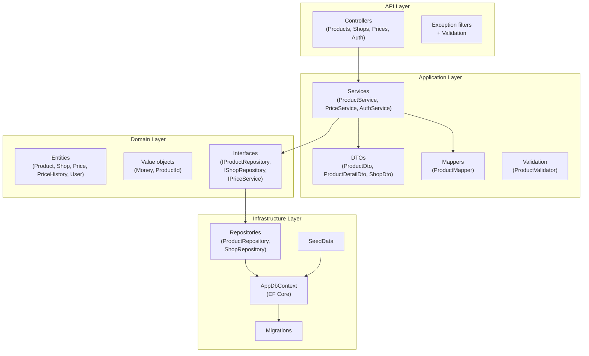
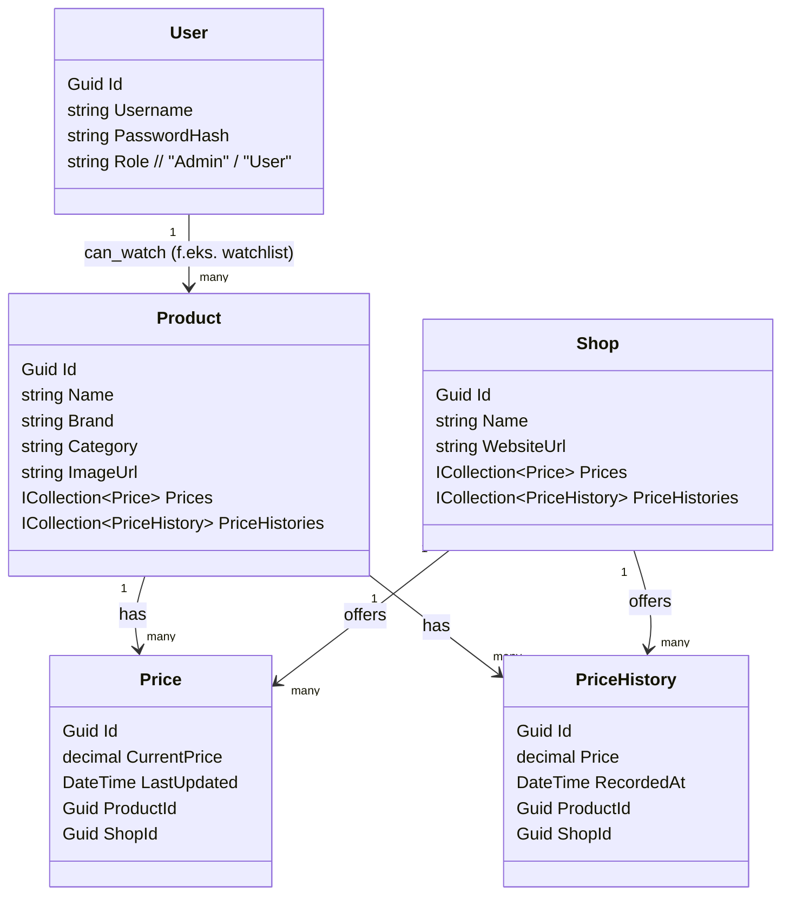
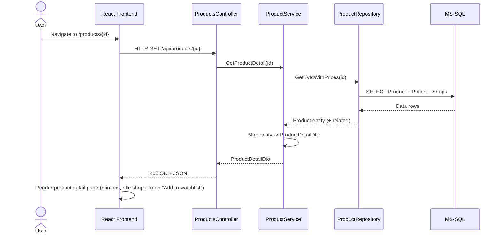
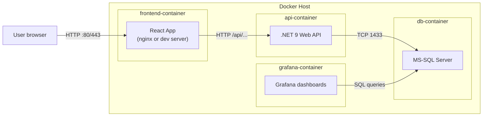

## Inspiration

This project is inspired by price comparison platforms such as PriceRunner.  
All code, database structures, and UI components are implemented from scratch
for educational and portfolio purposes only.  
We are not affiliated with, endorsed by, or connected to PriceRunner in any way.


Legend: 📁 Folder • 🧩 C#-Code • ⚙️ config/json/yaml • 🪪 .sln/.csproj • 🧾 Docs/Markdown • 🧪 Tests • 🐳 Docker/CI
```text
📁 PriceRunnerClone
  🪪 PriceRunnerClone.sln
  🧾 README.md
  🧾 LICENSE
  ⚙️ .env
  ⚙️ .env.app
  ⚙️ .gitignore
  📁 docs
    🧾 ARCHITECTURE.md          (lag, SOLID, diagrammer)
    🧾 ER-DIAGRAM.md            (db-modeller og relationer)
    🧾 API-DESIGN.md            (endpoints, DTO’er)
    🧾 TEST-STRATEGY.md         (hvad tester du hvor)
    🧾 PRESENTATION-NOTES.md    (hjælp til 15 min. oplæg)

  📁 backend
    🪪 PriceRunner.Api.csproj

    📁 src
      📁 Domain                   ← Forretningsmodel, ren C#
        🧩 Product.cs
        🧩 Shop.cs
        🧩 Price.cs
        🧩 PriceHistory.cs
        🧩 User.cs
        📁 Value
          🧩 Money.cs
          🧩 ProductId.cs
        📁 Interfaces
          🧩 IProductRepository.cs
          🧩 IShopRepository.cs
          🧩 IPriceService.cs

      📁 Application               ← Services, DTOs, use-cases
        📁 DTOs
          🧩 ProductDto.cs
          🧩 ProductDetailDto.cs
          🧩 ShopDto.cs
        📁 Services
          🧩 ProductService.cs
          🧩 PriceService.cs
          🧩 AuthService.cs
        📁 Mappers
          🧩 ProductMapper.cs
        📁 Validation
          🧩 ProductValidator.cs

      📁 Infrastructure            ← EF Core, SQL, repos, migrations
        📁 Data
          🧩 AppDbContext.cs
          🧩 SeedData.cs
        📁 Configurations
          🧩 ProductConfiguration.cs
          🧩 ShopConfiguration.cs
        📁 Repositories
          🧩 ProductRepository.cs
          🧩 ShopRepository.cs
        📁 Migrations              (autogenereret af EF)
          ⚙️ 20251124_InitialCreate.cs
        ⚙️ appsettings.json
        ⚙️ appsettings.Development.json

      📁 Api                       ← Web API lag
        🧩 Program.cs              (DI, pipeline, routing, Swagger)
        📁 Endpoints
          🧩 ProductEndpoint.cs
          🧩 ShopEndpoint.cs
          🧩 PriceEndpoint.cs
          🧩 AuthEndpoint.cs
        📁 Filters
          🧩 ApiExceptionFilter.cs
        📁 Models                  ← request/response-modeller
          🧩 CreateProductRequest.cs
          🧩 UpdateProductRequest.cs

      📁 Crawler (extra)
        🧩 PriceCrawlerService.cs  (IHostedService background job)
        📁 Providers
          🧩 IShopCrawler.cs            (interface)
          🧩 ExampleShopCrawler.cs      (konkret implementation)
        📁 Parsing
          🧩 HtmlPriceParser.cs

    📁 tests
      📁 PriceRunner.Domain.Tests       ← rene unit tests
        🧪 ProductTests.cs
      📁 PriceRunner.Application.Tests  ← service-lag
        🧪 ProductServiceTests.cs
      📁 PriceRunner.Api.Tests          ← simple integration tests
        🧪 ProductsEndpointTests.cs

    📁 scripts
      🧩 ResetDatabase.ps1
      🧩 RunAllTests.ps1

  📁 frontend
    🪪 pricerunner-frontend.csproj (hvis du kører ASP.NET+React template)
    📁 src
      📁 api
        🧩 httpClient.ts          (axios/fetch wrapper)
        🧩 productsApi.ts
        🧩 authApi.ts
      📁 components
        🧩 ProductCard.tsx
        🧩 PriceTag.tsx
        🧩 ShopBadge.tsx
        🧩 Layout.tsx
      📁 pages
        🧩 ProductsPage.tsx       (liste med søgning/filter)
        🧩 ProductDetailPage.tsx  (alle shops + billigste pris)
        🧩 CartPage.tsx           (watchlist/kurv)
        🧩 AdminProductsPage.tsx  (CRUD for admin)
        🧩 LoginPage.tsx
      📁 context
        🧩 CartContext.tsx
        🧩 AuthContext.tsx
      📁 hooks
        🧩 useProducts.ts
        🧩 useAuth.ts
      📁 routing
        🧩 AppRouter.tsx
      📁 styles
        ⚙️ main.css / Tailwind config
    ⚙️ vite.config.ts / package.json

  📁 monitoring
    📁 grafana
      ⚙️ grafana-datasource.yml    (SQL connection)
      ⚙️ grafana-dashboard.json    (prisstatistik mv.)

  📁 deploy
    🐳 docker-compose.yml          (api + sql + frontend + grafana)
    🐳 Dockerfile.backend
    🐳 Dockerfile.frontend
    🐳 .dockerignore
    
  📁 .gtihub
    📁 workflows
      ⚙️ github-actions-ci.yml       (byg + test + evt. docker build)

```

```text
Opgave 2: Pricerunner
	C# Backend API
	MS-SQL Database
	Grafena SQL hjemmeside
	React Frontend
	Data API for DataManagement

```

---

## 2-ugers plan (10 arbejdsdage)

Antag: du har ca. to uger med nogenlunde fulde dage. Målet er:
**MVP færdig i slut uge 1**, uge 2 = polish + ekstra features + dokumentation + øve præsentation.

### Dag 1 – Scope, domain & skeleton

* Vælg præcist scope:

  * Hvilke entiteter? (Product, Shop, Price, PriceHistory, User).
  * Hvad skal frontend *helt sikkert* kunne? (Liste → detaljer → watchlist/kurv).
* Lav overordnet **use cases-list**:

  * “Se alle produkter”, “Se billigste pris”, “Admin opret produkt”, osv.
* Opret:

  * GitHub repo + basic README.
  * `.sln` + backend Web API-projekt + React-frontend-projekt.
* Læg lag-strukturen (mapper + tomme projekter / namespaces).

*Milepæl*: Solution bygger, tomme /health-endpoint svarer.

---

### Dag 2 – Database & Domain

* Design **ER-diagram** for MS-SQL og læg det i `docs/ER-DIAGRAM.md`.
* Opret `Domain`-entiteter:

  * `Product`, `Shop`, `Price`, `PriceHistory`.
* Opret `AppDbContext` + EF-konfigurationer.
* Lav første migration og kør mod lokal SQL.
* Lav `SeedData` med dummy produkter/shops/priser.

*Milepæl*: DB oprettes, seede data findes, du kan køre `SELECT * FROM Products`.

---

### Dag 3 – Application-lag & Repositories

* Opret interface-baserede repos (`IProductRepository`, `IShopRepository`).
* Implementer EF-baserede repos i `Infrastructure`.
* Opret `ProductService` og `PriceService` i `Application`:

  * GetAllProducts (inkl. billigste pris).
  * GetProductDetail (inkl. alle shops + price history stub).
* Start på unit tests for Domain (fx pris-beregninger / small business rules).

*Milepæl*: Services kan kaldes fra integrationstest eller midlertidig console app.

---

### Dag 4 – API design & første endpoints

* Lav DTO’er & request models.
* Implementer controllers:

  * `GET /api/products`
  * `GET /api/products/{id}`
  * `POST /api/products` (admin)
  * `PUT /api/products/{id}` (admin)
* Tilføj:

  * Swagger.
  * Exception filter.
  * Simple model validation.

*Milepæl*: Du kan teste endpoints i Swagger/Postman med rigtig data.

---

### Dag 5 – Frontend MVP (vertical slice)

* Spin React/Vite op, lav:

  * `ProductsPage` med tabel/grid over produkter.
  * `ProductCard` med navn, billede, billigste pris.
* Implementer `productsApi.ts` til at kalde API.
* Simpel routing (React Router) mellem `/products` og `/products/:id`.
* Lav `ProductDetailPage` der viser alle shops og highlight billigste.

_Milepæl (uge 1 slut)**:**
Fra browseren kan du:

* Se produktliste (live fra DB gennem API).
* Klikke på et produkt og se detaljer/priser.

---

### Dag 6 – Watchlist/kurv + mere test

* Implementer `CartContext` eller “watchlist”:

  * Knappen “Add to watchlist”.
  * `/cart` side der viser valgte produkter.
* Beslut: gem watchlist lokalt (localStorage) eller i backend (MVP: lokalt).
* Tilføj flere unit tests:

  * `ProductService` og `PriceService` logik.
* Start 1–2 integrationstests for API (happy-path GET/POST).

*Milepæl*: Basic UX rundt i app’en føles nogenlunde komplet.

---

### Dag 7 – Autentifikation + admin

* Tilføj simple brugere:

  * Fx “admin” med hardcodet seed eller in-memory.
* Implementer JWT-baseret auth:

  * `POST /auth/login` → bearer token.
* Beskyt admin-endpoints (POST/PUT/DELETE på produkter/shops).
* Frontend:

  * `LoginPage` + `AuthContext`.
  * Admin-side til CRUD på produkter (kald auth-beskyttet API).

*Milepæl*: Kun admin kan oprette/ændre produkter; resten kun læse.

---

### Dag 8 – Docker, Grafana & CI

* Lav `Dockerfile.backend` og `Dockerfile.frontend`.
* Lav `docker-compose.yml` med:

  * `api`, `sqlserver`, `frontend`, evt. `grafana`.
* Konfigurer Grafana til at læse fra SQL:

  * Lav mindst ét dashboard med:

    * Gennemsnitlig pris pr. shop.
    * Antal produkter pr. kategori.
* GitHub Actions workflow:

  * `dotnet restore/build/test`.
  * `npm install/test/build` for frontend.
  * Evt. docker build (behøver ikke push).

*Milepæl*: Med én kommando (`docker-compose up`) kører hele systemet lokalt.

---

### Dag 9 – Dokumentation & UML

* Udfyld `README.md`:

  * Kort intro, teknologi-stack.
  * Installationsvejledning (lokalt + Docker).
  * Hvordan køre tests.
* Udfyld `ARCHITECTURE.md`:

  * Lagdiagram (Domain / Application / Infrastructure / Api / Frontend).
  * Kort begrundelse for valg (SOLID, interfaces, EF Core, React).
* Lav UML:

  * Klassediagram for Domain (Product/Shop/Price).
  * Sekvensdiagram for “User åbner ProductDetailPage”.

*Milepæl*: Repo’et ligner noget, en ekstern rekrutterer kan forstå uden at kende projektet.

---

### Dag 10 – Polishing, slides & ekstra features

* Ryd op i:

  * Døde klasser/filer.
  * Navngivning, magic strings, kommentarer.
* Forbered præsentation (15 min):

  * 3–4 slides om arkitektur & designvalg.
  * 1–2 slides om tests/CI/Docker.
  * 1–2 slides demo-flow (hvad du viser live).
* Hvis du har tid:

  * Lidt mere test.
  * Evt. begynde på crawler (se næste afsnit).

*Milepæl*: Alt kører stabilt; du kan køre demo 2–3 gange uden overraskelser.

---

## 3. Ekstra: Webcrawler til automatiske priser

Det her er **perfekt som “stretch goal” / ekstra slide**.
Du behøver ikke 120% færdig crawler – det er nok at vise en **klar arkitektur + en simpel implementation**, fx mod en dummy-shop.

### Arkitektur-idé

* Du har i forvejen:

  * `Shop` entitet.
  * `Product` + evt. `ExternalProductId` / `ShopProductUrl`.

* Tilføj:

  * Interface `IShopCrawler` i `Crawler/Providers`.
  * Implementering `ExampleShopCrawler` der:

    * Kender HTML-strukturen for “shoppen”.
    * Henter HTML med `HttpClient`.
    * Parser pris med fx HtmlAgilityPack (eller regex som MVP).
  * `PriceCrawlerHostedService` (implementerer `IHostedService`), der:

    * Kører fx hver time / ved opstart.
    * Går alle Shops igennem og kalder deres crawler.
    * Opdaterer `Price` og `PriceHistory` via `PriceService`.

* Evt. endpoint:

  * `POST /admin/crawler/runOnce` som admin kan klikke på i frontend:

    * Trigger et “run crawl nu” uden at du skal lave kompleks scheduling.

### Hvor i planen?

* **Minimum**: design + skelet kan laves på **Dag 8–10**, når MVP er solid.
* Start med *én* fake shop:

  * Læg en lokal HTML-fil med kendt struktur.
  * Lad crawleren hente fra `file://` eller en lille testserver.
  * Så slipper du for at bøvle med rigtige websites / robots.txt osv.

---











