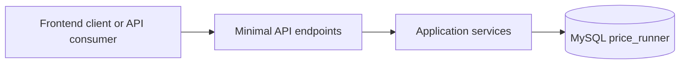
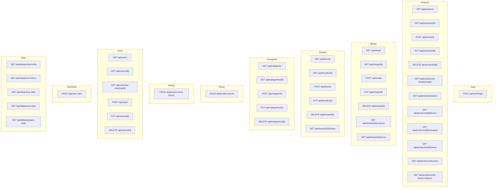

# API overview & diagrams

This document gives a visual overview of the HTTP API in the PriceRunnerClone
backend.

The API is built as a .NET 9 Minimal API with Dapper + MySQL.

---

## 1. High-level request flow

- **Client** – future React frontend, tools, etc.
- **API** – endpoint groups under `/api/*` in `src/API/Endpoints`.
- **Application services** – Dapper-based services in `src/Application/Services`.
- **Database** – MySQL database `price_runner`.

---

## 2. Endpoint groups

The main route groups and their responsibility:

Notes:

- `Data` endpoints are designed for **data analysis / ML / Grafana**.
- Product-related endpoints are split into:
  - general product CRUD
  - product price CRUD
  - product price history CRUD.

---

## 3. DTOs and request models

- **Request models** (API-bound):
  - `src/API/Models/*Models.cs`
  - Example: `CreateProductRequest`, `UpdateProductRequest`, `LoginRequest`.

- **Response DTOs** (application-bound):
  - `src/Application/DTOs/*.cs`
  - Designed to match SELECT projections and to be easy to consume from frontend and ML tools.

---

## 4. Error handling

All endpoints share the same global error handling:

- `src/API/Filters/ApiExceptionFilter.cs`
- Registered in `Program.cs` via `app.UseApiExceptionFilter(app.Environment);`
- Converts unhandled exceptions into a JSON payload with:
  - `statusCode`
  - `errorCode`
  - `message`
  - optional `details`, `traceId`, `path`.

This gives a consistent error contract across all endpoints.
