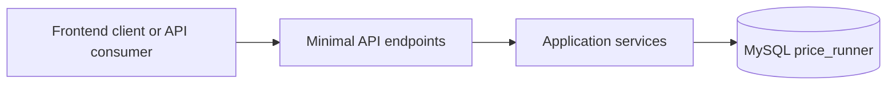

# API overview & diagrams

This document gives a visual overview of the HTTP API in the PriceRunnerClone
backend.

The API is built as a .NET 9 Minimal API with Dapper + MySQL.

---

## 1. High-level request flow



- **Client** – future React frontend, tools, etc.
- **API** – endpoint groups under `/api/*` in `src/API/Endpoints`.
- **Application services** – Dapper-based services in `src/Application/Services`.
- **Database** – MySQL database `price_runner`.

---

## 2. Endpoint groups

The main route groups and their responsibility:

```mermaid
flowchart TB
    subgraph Auth[/api/auth]
        A1["POST /login"]
    end

    subgraph Products[/api/products]
        P1["GET /"]
        P2["GET /{id}"]
        P3["POST /"]
        P4["PUT /{id}"]
        P5["DELETE /{id}"]
        P6["GET /by-shop/{shopId}"]
        P7["GET /search"]
        P8["GET /{id}/prices"]
        P9["GET /{id}/cheapest"]
        P10["GET /{id}/history"]
        P11["GET /all-prices"]
        P12["GET /with-brand-category"]
    end

    subgraph Shops[/api/shops]
        S1["GET /"]
        S2["GET /{id}"]
        S3["POST /"]
        S4["PUT /{id}"]
        S5["DELETE /{id}"]
        S6["GET /{id}/products"]
        S7["GET /{id}/prices"]
    end

    subgraph Brands[/api/brands]
        B1["GET /"]
        B2["GET /{id}"]
        B3["POST /"]
        B4["PUT /{id}"]
        B5["DELETE /{id}"]
        B6["GET /{id}/shops"]
    end

    subgraph Categories[/api/categories]
        C1["GET /"]
        C2["GET /{id}"]
        C3["POST /"]
        C4["PUT /{id}"]
        C5["DELETE /{id}"]
    end

    subgraph Prices[/api/product-prices]
        PP1["CRUD product_prices"]
    end

    subgraph History[/api/product-price-history]
        PH1["CRUD products_history"]
    end

    subgraph Users[/api/users]
        U1["GET /"]
        U2["GET /{id}"]
        U3["GET /by-role/{roleId}"]
        U4["POST /"]
        U5["PUT /{id}"]
        U6["DELETE /{id}"]
    end

    subgraph UserRoles[/api/user-roles]
        UR1["CRUD user_roles"]
    end

    subgraph Data[/api/data]
        D1["GET /products-flat"]
        D2["GET /price-history"]
        D3["GET /shop-stats"]
        D4["GET /brand-stats"]
        D5["GET /category-stats"]
    end
```

Notes:

- `Data` endpoints are designed for **data analysis / ML / Grafana**.
- Product-related endpoints are split into:
  - general product CRUD
  - product price CRUD
  - product price history CRUD.

---

## 3. DTOs and request models

- **Request models** (API-bound):
  - `src/API/Models/*Models.cs`
  - Example: `CreateProductRequest`, `UpdateProductRequest`, `LoginRequest`.

- **Response DTOs** (application-bound):
  - `src/Application/DTOs/*.cs`
  - Designed to match SELECT projections and to be easy to consume from frontend and ML tools.

---

## 4. Error handling

All endpoints share the same global error handling:

- `src/API/Filters/ApiExceptionFilter.cs`
- Registered in `Program.cs` via `app.UseApiExceptionFilter(app.Environment);`
- Converts unhandled exceptions into a JSON payload with:
  - `statusCode`
  - `errorCode`
  - `message`
  - optional `details`, `traceId`, `path`.

This gives a consistent error contract across all endpoints.
