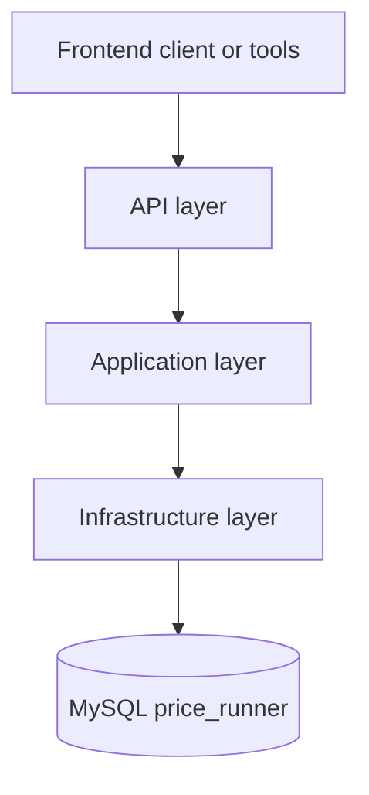

# Architecture

This document describes the overall architecture of the PriceRunnerClone backend.

The project is a small, layered backend meant as a portfolio-ready full stack
starter with Dapper, MySQL and Minimal APIs.

---

## 1. Goals

- Clear separation of concerns
- Simple to extend (more endpoints, frontend, ML, Grafana)
- No heavy ORM – **Dapper + handwritten SQL**

---

## 2. Project structure

```text
PriceRunnerClone/
  PriceRunnerClone.csproj
  appsettings.json
  appsettings.Development.json
  Properties/
    launchSettings.json

  src/
    API/
      Endpoints/
      Filters/
      Models/
      Program.cs

    Application/
      DTOs/
      Services/
      Validation/
      Mappers/

    Infrastructure/
      Configurations/
      Data/
      Migrations/
      ServiceCollectionExtension.cs

    Crawler/
      Parsing/
      Providers/
      PriceCrawlerService.cs   (placeholder, not used yet)

  PriceRunner.Application.Tests/
    PriceRunner.Application.Tests.csproj
    PriceRunner.Application.Tests/
      ProductServiceTests.cs   (Brand/User validator tests)
    scripts/
      ResetDatabase.ps1
      RunAllTests.ps1
```

---

## 3. Layered architecture

### 3.1 Layers and dependencies



Rules:

- **API layer** depends on **Application**.
- **Application** depends on **Infrastructure** abstractions (here: `IDbConnection`).
- **Infrastructure** provides concrete DB configuration and factories.
- Tests depend on these layers but not the other way around.

---

### 3.2 API layer (`src/API`)

**Responsibilities**

- HTTP routing, request/response binding
- OpenAPI / Swagger setup
- Global exception handling

**Key elements**

- `Program.cs`
  - Registers services and validators
  - `builder.Services.AddInfrastructure(builder.Configuration);`
  - Adds Swagger and OpenAPI
  - Maps endpoint groups:
    - `app.MapProductEndpoints();`
    - `app.MapShopEndpoints();`
    - `app.MapBrandEndpoints();`
    - `app.MapCategoryEndpoints();`
    - `app.MapUserRoleEndpoints();`
    - `app.MapUserEndpoints();`
    - `app.MapAuthEndpoints();`
    - `app.MapDataEndpoints();`
    - `app.MapProductPriceEndpoints();`
    - `app.MapProductPriceHistoryEndpoints();`

- `Endpoints/*Endpoint.cs`  
  One static class per aggregate:
  - `ProductEndpoint`, `ShopEndpoint`, `BrandEndpoint`, `CategoryEndpoints`
  - `ProductPriceEndpoint`, `ProductPriceHistoryEndpoint`
  - `UserEndpoints`, `UserRoleEndpoints`, `AuthEndpoint`, `DataEndpoint`

- `Models/*Models.cs`  
  Small request models for POST/PUT (create/update).

- `Filters/ApiExceptionFilter.cs`  
  Global exception handler that returns JSON error payloads.

---

### 3.3 Application layer (`src/Application`)

**Responsibilities**

- Application logic
- Dapper-based SQL queries
- Validation and DTOs
- Simple mapping (where needed)

**DTOs (`DTOs/*.cs`)**

- `ProductDto`, `ProductWithPriceDto`, `ProductPriceDto`, `ProductHistoryDto`
- `ShopDto`, `BrandDto`, `CategoryDto`
- `UserDto`, `UserRoleDto`, `LoginResponseDto`
- `ProductFlatDataDto`, `PriceHistoryDataDto`, `ShopStatsDto`, `BrandStatsDto`, `CategoryStatsDto`

**Services (`Services/*.cs`)**

Each service wraps Dapper queries and is consumed from endpoints:

- `ProductService` – CRUD products, search, by-shop, aggregated product lists
- `ShopService` – CRUD shops, plus products and prices per shop
- `BrandService` – CRUD brands, plus basic statistics
- `CategoryService` – CRUD categories
- `PriceService` – product price CRUD + cheapest price + history
- `DataService` – ML/Grafana-friendly datasets:
  - `GetProductsFlatAsync`
  - `GetPriceHistoryAsync`
  - `GetShopStatsAsync`
  - `GetBrandStatsAsync`
  - `GetCategoryStatsAsync`
- `UserService` – CRUD users
- `UserRoleService` – CRUD roles
- `AuthService` – simple login by user name + password hash

All services take an `IDbConnection` (MySQL) injected by DI.

**Validation (`Validation/*.cs`)**

- `BrandValidator`, `CategoryValidator`, `ProductValidator`,
  `ShopValidator`, `UserRoleValidator`, `UserValidator`
- Return `IReadOnlyList<string>` with validation error messages.
- Used by endpoints before calling services.

**Mappers**

- `ProductMapper` (currently minimal – ready for more mapping logic later).

---

### 3.4 Infrastructure layer (`src/Infrastructure`)

**Responsibilities**

- Database configuration
- Connection factory
- Migration script placeholders

**Files**

- `Configurations/DatabaseOptions.cs`
  - Strongly typed options bound from configuration section `Database`.
  - Holds the MySQL connection string.

- `Data/MySqlDbConnectionFactory.cs`
  - Implements `IDbConnectionFactory`.
  - Creates and opens `MySqlConnection`.

- `ServiceCollectionExtension.cs`
  - `AddInfrastructure(IConfiguration)`:
    - Reads connection string from
      - `Database:ConnectionString` in `appsettings.*` or
      - `MYSQL_CONNECTION_STRING` environment variable.
    - Registers `IDbConnectionFactory` and scoped `IDbConnection`.

- `Migrations/*.sql`
  - Placeholders for schema and seed scripts.
  - Currently empty; DB schema WIP.

---

### 3.5 Crawler (`src/Crawler`)

**Status: not used yet**

- `PriceCrawlerService` – placeholder for a future `IHostedService`
  that will collect prices from external shops.
- `Parsing/HtmlPriceParser.cs`, `Providers/IShopCrawler.cs`,
  `Providers/ExampleShopCrawler.cs` – currently empty.

For the MVP and the current presentation, the crawler is intentionally
parked and not wired into `Program.cs`.

---

### 3.6 Legacy domain model

Originally, the project started with a more classic Domain model + Entity Framework.

This code has been moved out of the compile (see `PriceRunnerClone.csproj`):

```xml
<ItemGroup>
  <Compile Remove="Kode der ikke længere bliver brugt\**\*.cs" />
</ItemGroup>
```

Rationale:

- For this assignment and time frame, handwritten SQL + Dapper is:
  - easier to reason about
  - faster to tune for ML/Grafana datasets

The old domain model is kept as documentation of the original approach,
but **not compiled** and **not used**.

---

## 4. Configuration and environments

- `appsettings.json`
  - Logging configuration.
- `appsettings.Development.json`
  - `Database:ConnectionString` for local MySQL.

