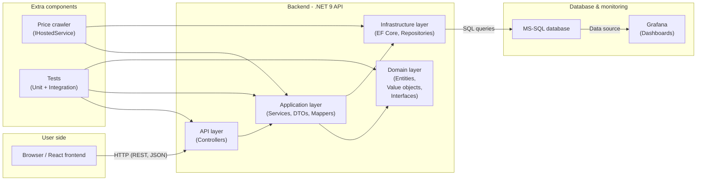
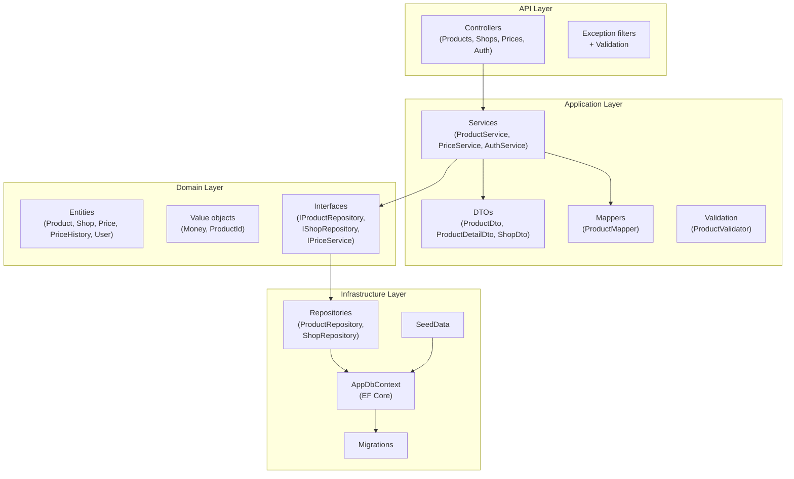
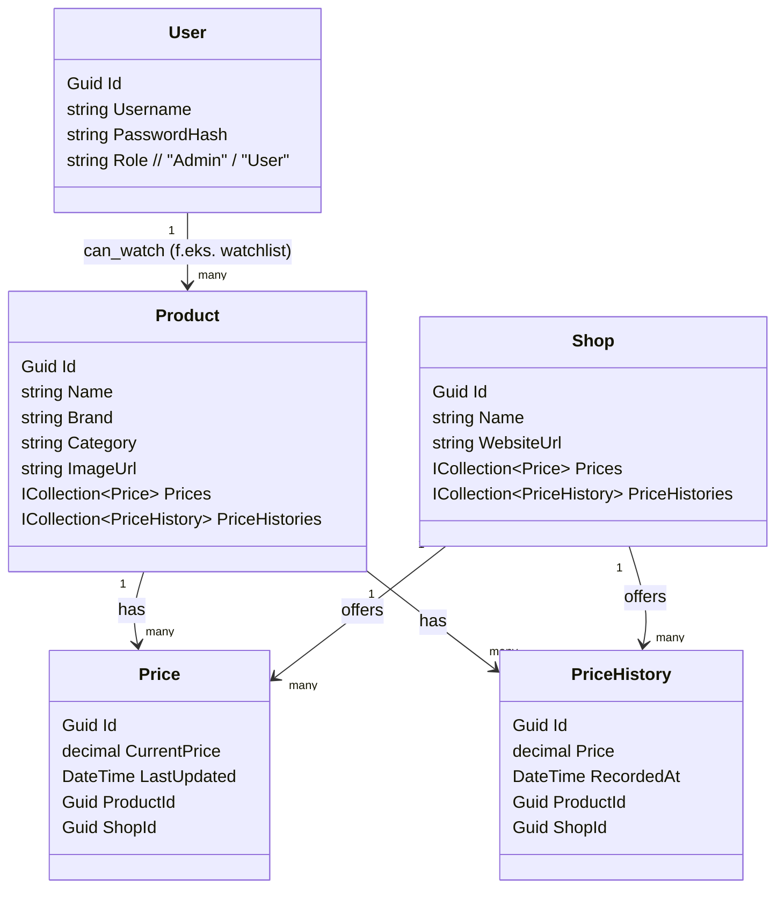
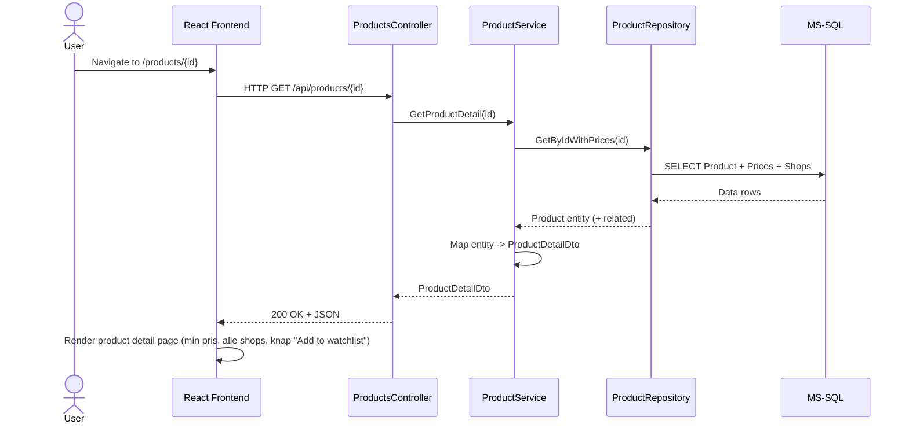
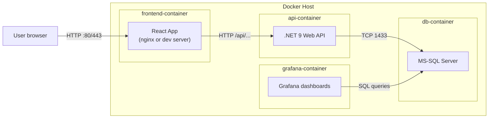

```mermaid
flowchart LR
    subgraph UserSide["User side"]
        U["Browser / React frontend"]
    end

    subgraph Backend["Backend - .NET 9 API"]
        AP["API layer\n(Controllers)"]
        APP["Application layer\n(Services, DTOs, Mappers)"]
        DOM["Domain layer\n(Entities,\nValue objects,\nInterfaces)"]
        INF["Infrastructure layer\n(EF Core, Repositories)"]
    end

    subgraph DB["Database & monitoring"]
        SQL["MS-SQL database"]
        GRAF["Grafana\n(Dashboards)"]
    end

    subgraph Extra["Extra components"]
        CRAWLER["Price crawler\n(IHostedService)"]
        TESTS["Tests\n(Unit + Integration)"]
    end

    U -->|"HTTP (REST, JSON)"| AP
    AP --> APP
    APP --> DOM
    APP --> INF
    INF -->|"SQL queries"| SQL

    CRAWLER --> APP
    CRAWLER --> INF

    SQL -->|"Data source"| GRAF

    TESTS --> AP
    TESTS --> APP
    TESTS --> DOM

```

```mermaid
flowchart TB
    subgraph API["API Layer"]
        CTRL["Controllers\n(Products, Shops, Prices, Auth)"]
        FILT["Exception filters\n+ Validation"]
    end

    subgraph APP["Application Layer"]
        SRV["Services\n(ProductService, PriceService, AuthService)"]
        DTO["DTOs\n(ProductDto, ProductDetailDto, ShopDto)"]
        MAP["Mappers\n(ProductMapper)"]
        VAL["Validation\n(ProductValidator)"]
    end

    subgraph DOM["Domain Layer"]
        ENT["Entities\n(Product, Shop, Price, PriceHistory, User)"]
        VO["Value objects\n(Money, ProductId)"]
        INTF["Interfaces\n(IProductRepository,\n IShopRepository,\n IPriceService)"]
    end

    subgraph INF["Infrastructure Layer"]
        DBCTX["AppDbContext\n(EF Core)"]
        REPO["Repositories\n(ProductRepository,\n ShopRepository)"]
        MIG["Migrations"]
        SEED["SeedData"]
    end

    CTRL --> SRV
    SRV --> DTO
    SRV --> MAP
    SRV --> INTF
    INTF --> REPO
    REPO --> DBCTX
    DBCTX --> MIG
    SEED --> DBCTX

```

```mermaid
classDiagram
    class Product {
        Guid Id
        string Name
        string Brand
        string Category
        string ImageUrl
        ICollection~Price~ Prices
        ICollection~PriceHistory~ PriceHistories
    }

    class Shop {
        Guid Id
        string Name
        string WebsiteUrl
        ICollection~Price~ Prices
        ICollection~PriceHistory~ PriceHistories
    }

    class Price {
        Guid Id
        decimal CurrentPrice
        DateTime LastUpdated
        Guid ProductId
        Guid ShopId
    }

    class PriceHistory {
        Guid Id
        decimal Price
        DateTime RecordedAt
        Guid ProductId
        Guid ShopId
    }

    class User {
        Guid Id
        string Username
        string PasswordHash
        string Role  // "Admin" / "User"
    }

    Product "1" --> "many" Price : has
    Shop "1" --> "many" Price : offers

    Product "1" --> "many" PriceHistory : has
    Shop "1" --> "many" PriceHistory : offers

    User "1" --> "many" Product : can_watch (f.eks. watchlist)
```

```mermaid
sequenceDiagram
    actor User
    participant FE as React Frontend
    participant API as ProductsController
    participant APP as ProductService
    participant REPO as ProductRepository
    participant DB as MS-SQL

    User->>FE: Navigate to /products/{id}
    FE->>API: HTTP GET /api/products/{id}
    API->>APP: GetProductDetail(id)
    APP->>REPO: GetByIdWithPrices(id)
    REPO->>DB: SELECT Product + Prices + Shops
    DB-->>REPO: Data rows
    REPO-->>APP: Product entity (+ related)
    APP->>APP: Map entity -> ProductDetailDto
    APP-->>API: ProductDetailDto
    API-->>FE: 200 OK + JSON
    FE->>FE: Render product detail page (min pris, alle shops, knap "Add to watchlist")
```

```mermaid
flowchart LR
    subgraph Host["Docker Host"]
        subgraph FrontendContainer["frontend-container"]
            FE["React App\n(nginx or dev server)"]
        end

        subgraph ApiContainer["api-container"]
            API[".NET 9 Web API"]
        end

        subgraph DbContainer["db-container"]
            SQL["MS-SQL Server"]
        end

        subgraph GrafanaContainer["grafana-container"]
            GRAF["Grafana dashboards"]
        end
    end

    UserBrowser["User browser"] -->|"HTTP :80/443"| FE
    FE -->|"HTTP /api/..."| API
    API -->|"TCP 1433"| SQL
    GRAF -->|"SQL queries"| SQL

```

